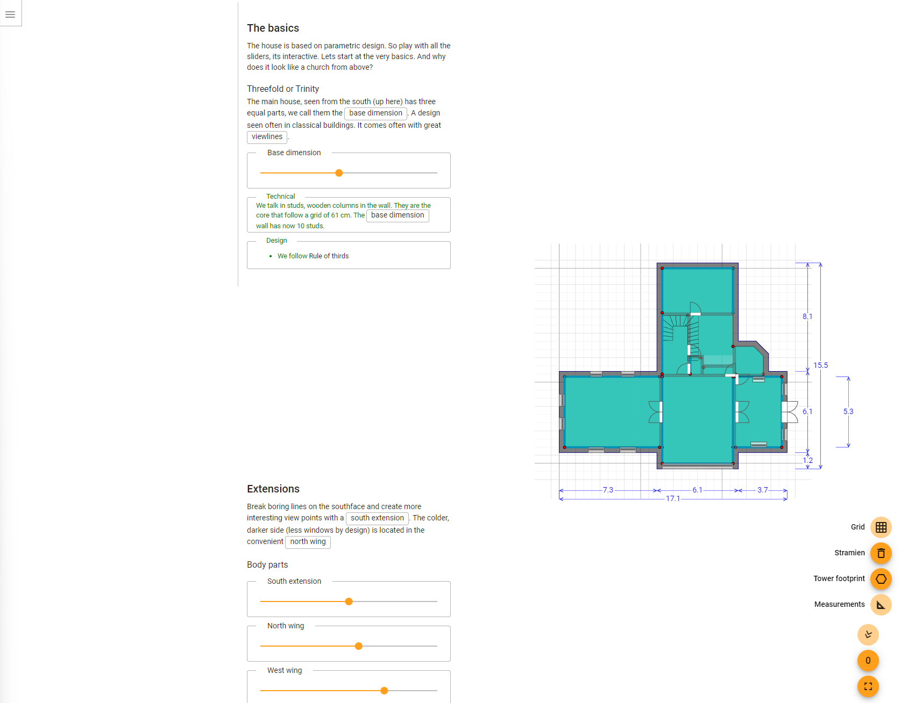

# Open Passive

 

### A open source passive house Project

# 1 The website

Your looking at a technical document. For the main website see:

[PassiveOpen.com](https://passiveopen.com)

# 2 Lindelund default design

Start here if you want to design your own house. With your own parameters. See [a example typescript file](src\app\house\lindelund\lindeLund.ts). In the future this can be a YAML or even a UI. Its a bit work in process, because now you would clone/fork this project and overrule this file. For now see [the technical angular documentation](src\readme.md)

# 3 Angluar

This is even more technical. It has its [own documentation](src\readme.md)
